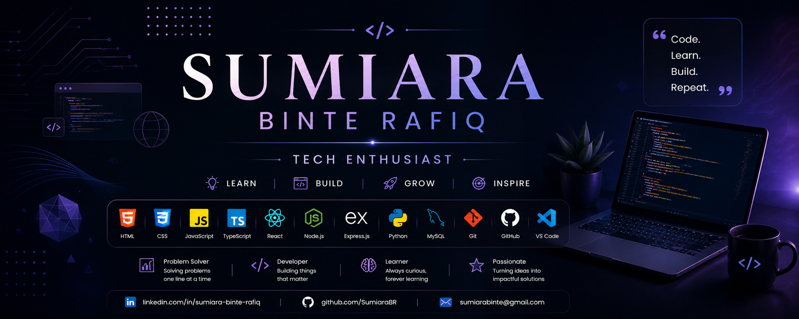

# 👋 Hi, I'm Sumiara Binte Rafiq

### Aspiring Full-Stack Web Developer | Tech Enthusiast

## 👩‍💻 About Me

I am a Computer Science graduate from **Daffodil International University** with a strong passion for technology and software development. I enjoy building practical, user-friendly applications and exploring how technology can solve real-world problems.

My interests include **frontend and backend development, databases, data analysis, and machine learning**. I love learning new technologies, working on meaningful projects, and continuously improving my skills as a developer.

## 🌱 Currently Working On

* ⚛️ Building web applications with **React**
* 💻 Strengthening my **frontend and backend development** skills
* 🗄️ Working with **MySQL and relational databases**
* 🔧 Exploring **Node.js, Express.js and REST APIs**
* 🐍 Working with **Python for data analysis and machine learning**
* 🤖 Exploring Machine Learning and AI
* 🚀 Building practical projects and continuously improving my development skills

## 🛠️ Skills & Technologies

### Frontend Development

### Backend Development

### Database & Data

### Tools & Platforms

## 🚀 Featured Projects

### 🌐 DevConf 2026

A modern conference website designed to showcase event information, speakers, registration and other important details through a clean and engaging interface.

**Tech Stack:** HTML • CSS • JavaScript

---

### 🧬 Ovarian Cancer Stage Classification

A machine learning project focused on classifying ovarian cancer stages using **TCGA-OV clinical and molecular data**. The project includes data preprocessing, feature selection, class balancing, multiple machine learning models and SHAP-based explainability.

**Tech Stack:** Python • Pandas • NumPy • Scikit-learn • XGBoost • LightGBM • SHAP

## 📊 GitHub Statistics

## 🌐 Connect With Me

---

✨ Thanks for visiting my profile! ✨

### 💡 Learn • Build • Grow • Inspire

⭐ **Thanks for visiting my profile!**

